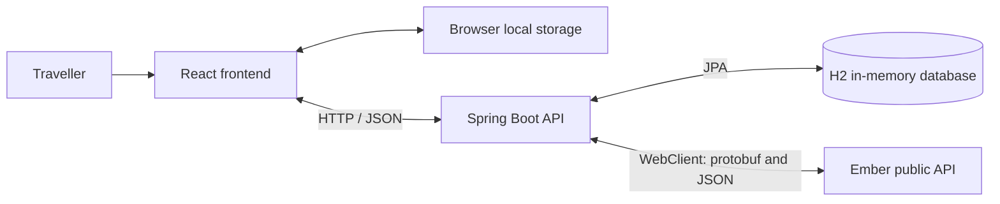

# GoEmber

## Introduction and overview

GoEmber turns Ember bus journeys into a personal travel passport. Browse live
departures, track a ride, collect bus stop stamps, and see the towns and bus
numbers you have visited or ridden.

The application began as a 5 hour hackathon project, and has been cleaned up and some bugs have been fixed since.
It uses Java, Spring Boot, React, Vite, and an H2 in-memory database.
Live transport information comes from Ember's public API.

The main user flow is:

1. Open the passport on the home page, or search for a journey on `/route-tracker`.
2. Choose a bus and load its full route. Search fields can be left blank to browse
   upcoming departures.
3. Start tracking when boarding. The tracker follows observed route progress.
4. End the ride to save reached stops and journey statistics. A brief notification
   confirms saved stamps; unsuccessful saves remain queued for retry.
5. Browse stamps, cities/towns, and bus numbers in separate viewable collections.

The distance total is an estimate from stop locations, not measured road mileage.
Accounts are currently guest sessions, and server-side data lasts only until the
backend stops.

## How to run

### Install and start

Install the frontend dependencies using the lockfile:

```powershell
npm.cmd --prefix Frontend/go-ember-frontend ci
```

Start the backend in one terminal:

```powershell
.\mvnw.cmd spring-boot:run
```

Start the frontend in another terminal:

```powershell
npm.cmd run dev
```

### Configuration

| Environment variable | Default | Purpose |
| --- | --- | --- |
| `SERVER_PORT` | `8080` | Backend HTTP port |
| `EMBER_API_BASE_URL` | `https://api.ember.to` | Upstream transport API |
| `EMBER_API_REQUEST_TIMEOUT` | `10s` | Ember client request timeout |
| `VITE_API_BASE_URL` | `http://localhost:8080` | Backend URL used by the frontend |

Set frontend variables before starting Vite or building the frontend. A built
frontend needs rebuilding to use a different API URL.

### Tests and builds

Run from the repository root:

```powershell
.\mvnw.cmd verify
npm.cmd test
npm.cmd run lint
npm.cmd run build
```

Maven verifies the backend and creates an executable `target/*-exec.jar`. The
frontend build writes to `Frontend/go-ember-frontend/dist`. There is currently no
deployment configuration in the repository.

Backend tests use JUnit, mocked Ember responses, and H2 to exercise API contracts,
validation, authorization, persistence, concurrency, distance calculations, and
external failures. Frontend tests use Node's test runner and React server rendering
for ride rules, API requests, queue recovery, and rendered states. Oxlint checks
the frontend source. There is no standalone TypeScript check or browser interaction
suite.

## Architecture and system design

### Components and data ownership

The application is a React client and a single Spring Boot backend. React calls
the backend through `BackendAPI.js`; the backend owns persistence and access to
the external transport API.



| System | Responsibility |
| --- | --- |
| Ember API | Live vehicles, trip routes, canonical stop names, regions, and coordinates |
| Spring Boot | HTTP validation, guest access, transport mapping, award recording, and statistics |
| H2 | Guest credentials, passports, stamp catalogue, recorded visits, and completed journeys |
| React | Search, bus selection, ride progress, collection pages, and save feedback |
| Browser local storage | Guest session details, active ride, and awards awaiting server acknowledgement |

H2 stores application-specific records; it does not replace Ember as the source
of live transport data. Browser storage supports recovery but is not the server's
record of saved awards.

### Live tracking and the external API boundary

`GET /api/vehicles/live` accepts optional `origin`, `destination`, `trackedTripUid`,
and `detailsTripUid` parameters. `EmberClient` fetches the live vehicle feed as
protobuf and trip details and locations as JSON. `EmberRouteMapper` turns those
responses into ordered route events; `EmberService` filters and orders departures
before returning the application's bus response to React.

The tracker polls every 15 seconds. Full trip details are requested for selected
or tracked trips, and boarding requires a loaded route. Route event IDs distinguish
multiple visits to the same physical stop. When the current-stop field is absent,
the summary can show the stop preceding the next stop on the full route. It does
not infer that stop from the sparse feed's endpoints alone.

The HTTP client uses connection and response timeouts, bounded parallel trip
requests, and application-level errors for upstream failures. It does not add
automatic retries. An unavailable feed does not erase an active ride: the user can
end it using previously observed progress.

### Recording rides and recovering failed saves

`ride.js` advances through observed route events, including intermediate stops
between observations. Ending a ride queues only the reached portion, from boarding
through the last reached stop.

`awardSync.js` sends stop visits in batches, then journey completions and town
visits. Each acknowledged write is checkpointed locally before its queued work is
removed. Stable operation IDs and journey keys make retries safe without duplicate
awards; those identifiers must be retained across retries.

Passport mutations lock the owning user. Stamp catalogue creation uses a separate
transaction and a process-local lock, appropriate to the current single-process
design. External lookups happen outside passport write transactions. This design
would need review before running multiple backend instances.

Guest creation uses `POST /api/users?name=Guest`. Private user, passport, and journey
requests send `Authorization: Bearer <token>`; the backend stores only the token's
hash. A guest credential provides access to its own records, rather than allowing
access based on a numeric user ID alone.

### Passport collections and statistics

The passport response separates bus stop `stamps`, deduplicated `cities`, and
`buses`. Only bus stop stamps contribute to the stamp total and level progress.
City cards include `visitCount`; bus entries include `routeNumber` and `rideCount`.
The `busNumbers` list and distinct cover totals remain available.

Each saved ride counts once for each city it visits and once for its bus number.
City counting groups stop and town awards by their stable journey prefix, so
multiple stops, aliases, and retries do not inflate counts. Standalone visits count
separately. Legacy visits without operation IDs remain individual visits because
their original ride identity cannot be recovered.

`CityNames` normalizes upstream region labels when producing the city collection.
Raw stamp metadata remains available for later corrections. Stop names are never
used as a fallback for city names. Edinburgh Airport maps to Edinburgh, Aberdeen
Airport to Aberdeen, and Glasgow Airport to Paisley. Unmapped facility labels
are excluded from city cards while their stop stamps remain available. New aliases
should be explicit and verified rather than inferred by stripping words from names.

New rides estimate distance by summing great-circle distances between consecutive
visited stops. Repeated visits remain in sequence, so loops count. This is a simple
estimate of the stop itinerary, not road mileage or a GPS trace. Coordinates come
from saved stamps, with bounded Ember location batches for missing coordinates.
Single-stop rides have zero observed distance. If required coordinates are missing,
the journey distance and the passport total remain unavailable.

Journey completions accept optional `visitedLocationIds`: 1 to 200 positive IDs
in travel order, including boarding and alighting. Older queued requests without
this field retain the endpoint-only estimate. Previously saved distances remain
unchanged because those records did not retain enough route data to recalculate
them reliably.

### Repository map

| Path | Responsibility |
| --- | --- |
| `pom.xml`, `mvnw`, `mvnw.cmd` | Backend build and Maven wrapper |
| `src/main/java/com/goember/hackathon/PassportApplication.java` | Spring Boot entry point |
| Backend `ember` package | External client, route mapping, and departure selection |
| Backend `user`, `passport`, `stamp`, `journey`, `stop` packages | Feature controllers, services, entities, and repositories |
| Backend `geo` and `config` packages | Distance calculation, HTTP client, CORS, and exception handling |
| `src/main/proto` | Live vehicle wire schema; Maven generates Java into `target` |
| `src/main/resources/application.properties` | Backend and database configuration |
| `Frontend/go-ember-frontend/src/main.jsx`, `Frontend/go-ember-frontend/src/App.jsx` | React entry point and page selection |
| Frontend `src/pages`, `src/components`, `src/css` | Screens, reusable UI, and styling |
| Frontend `src/services` | Backend requests, ride rules, persistence, and award synchronization |
| `src/test`, `Frontend/go-ember-frontend/test` | Backend and frontend tests |
| Root `package.json` | Convenience commands that delegate to the frontend package |

Existing `/api/journeys`, `/api/stops`, and `/api/ember` endpoints remain available,
including endpoints outside the frontend's current flow.

## Future work and next steps

1. **Automate the existing checks in CI.** Run Maven verification, frontend tests,
   lint, and the production build on every change.
2. **Add user accounts and user accounts.** Use a persistent database, such as PostgreSQL, to store user information and the option to create a user account.
3. **Prepare deployment deliberately.** Add environment configuration, HTTPS,
   production CORS origins, and monitoring. Review the process-local locking model
   before scaling beyond one backend instance.
